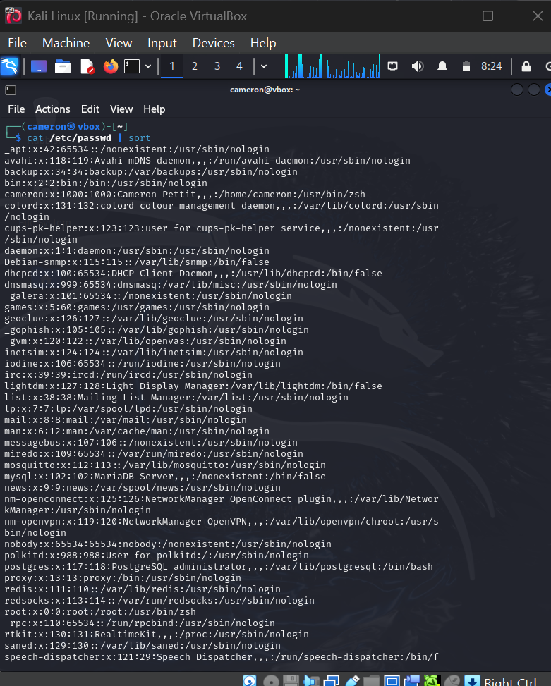
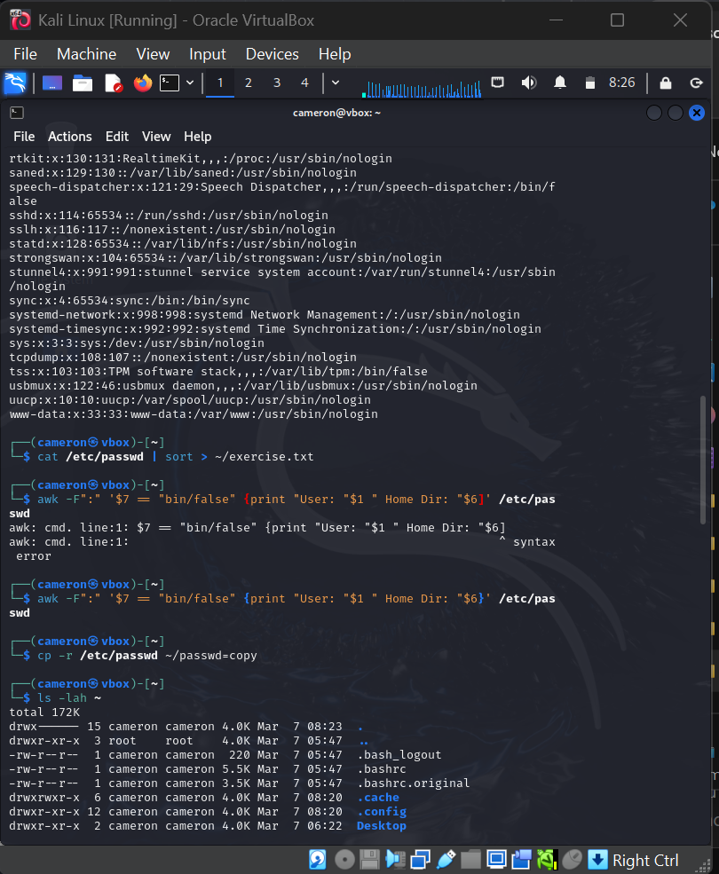
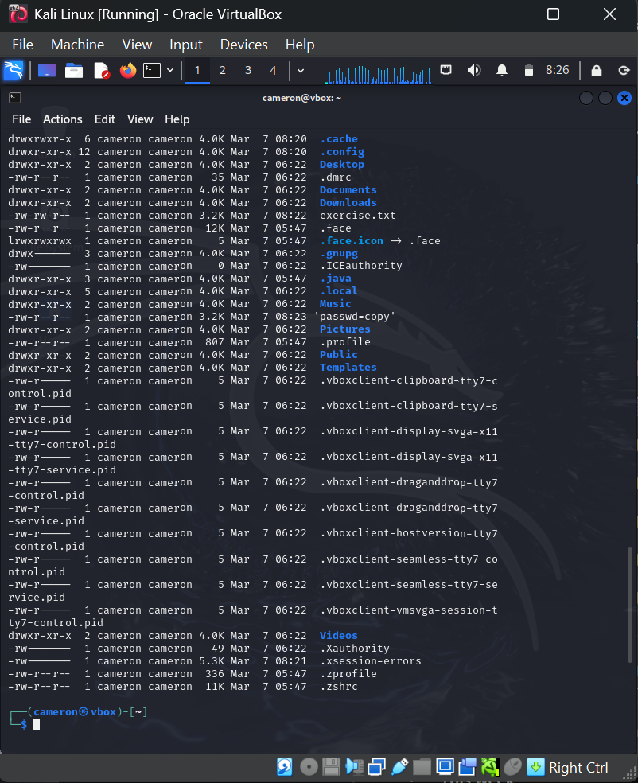

# Linux Commands Practice ✅

## 🔹 Overview
Practicing basic Linux commands is essential for penetration testing. These commands help in **file manipulation, user enumeration, and system information gathering**.

## 🔹 Commands Executed
```bash
# Print sorted user accounts
cat /etc/passwd | sort

# Save sorted output to a file
cat /etc/passwd | sort > ~/exercise.txt

# Extract users with no shell access
awk -F":" '$7 == "/bin/false" {print "User: "$1 " Home Dir: "$6}' /etc/passwd

# Copy the passwd file
cp -r /etc/passwd ~/passwd-copy

# List all files in home directory
ls -lah ~

# Explanation of Each Command
cat /etc/passwd | sort → Lists all system users in sorted order.

awk -F":" '$7 == "/bin/false" {print "User: "$1 " Home Dir: "$6}' /etc/passwd → Extracts users with no shell access.

cp -r /etc/passwd ~/passwd-copy → Copies the passwd file.

ls -lah ~ → Lists all files in the home directory with permissions.

# Screenshot
Here is a screenshot of the command output:








# Key Learnings
User Enumeration: The /etc/passwd file stores user details.

Sorting & Filtering: Commands can be chained to extract relevant data.

File Copying: cp -r copies files recursively.

File Permissions: The ls -lah command helps analyze file ownership & access.
